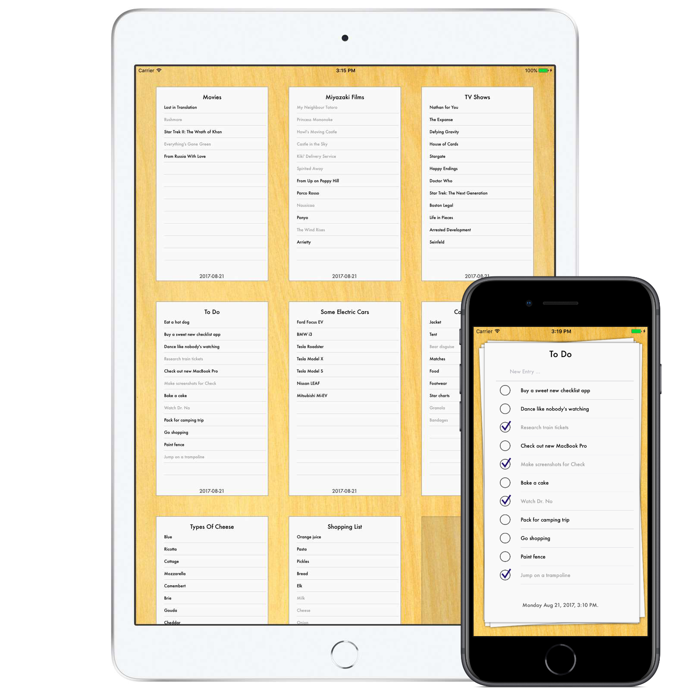

I created Check in the summer of 2011, and maintained it until its retirement in 2019.

Check was an iPad and iPhone list manager that was as simple as it was beautiful. Set in Futura, on simulated stacks of paper, even the most mundane lists came to life as works of art. Finally, your lists could be beautiful. 

Check would sync your lists between your devices using Apple's iCloud service. So wherever you are, you could have your shopping lists, to-do lists, bucket lists, or whatever other list you could think of. 

With Check, you could email your lists to friends, families, bosses, Mothers-in-law, doctors, engineers, curling coaches ... and the list went on!

- *You would be amazed as Check makes you at least 6,000 times more efficient in every aspect of your day-to-day life!**

- *Your jaw would feel excruciating pain, as it dropped to the floor when Check made you new friends, and gave you more power over old ones.**

- *You’d look back on your pre-Check life as a distant ghost of a reflection of a dream, as you became a stronger, smarter, faster, sexier version of yourself than you ever thought possible.**

- *A mind-numbing satisfaction would take hold, when you realized that you are better than over 99% of the population**

Check did all of these things, and more.†

>*Results not typical

>†Or maybe it did none of them ...