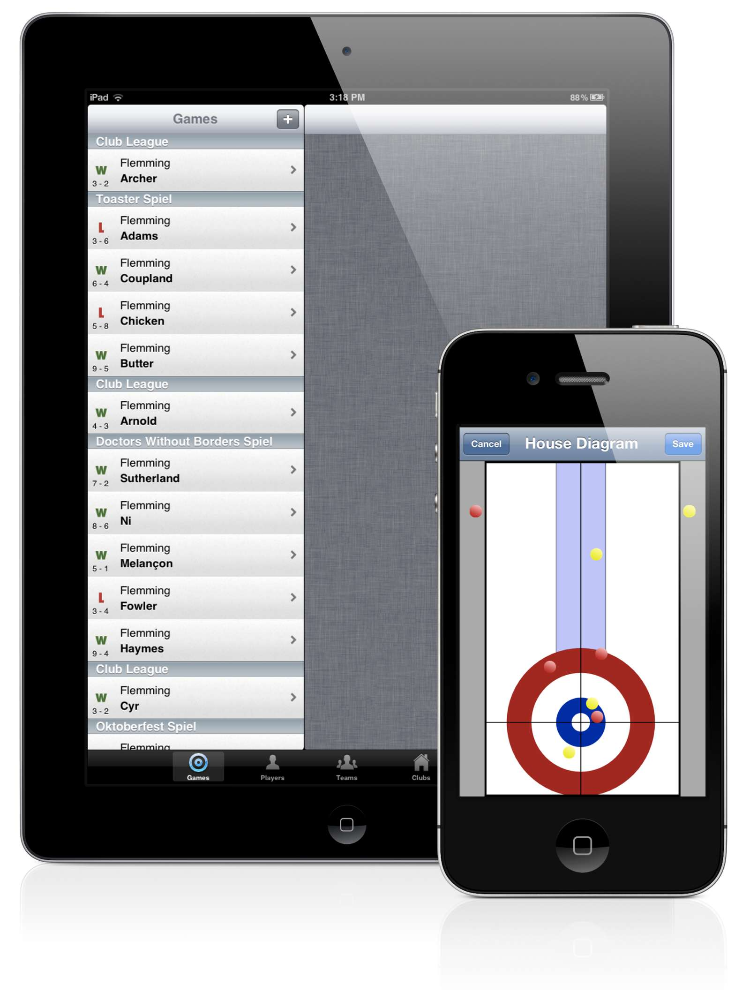
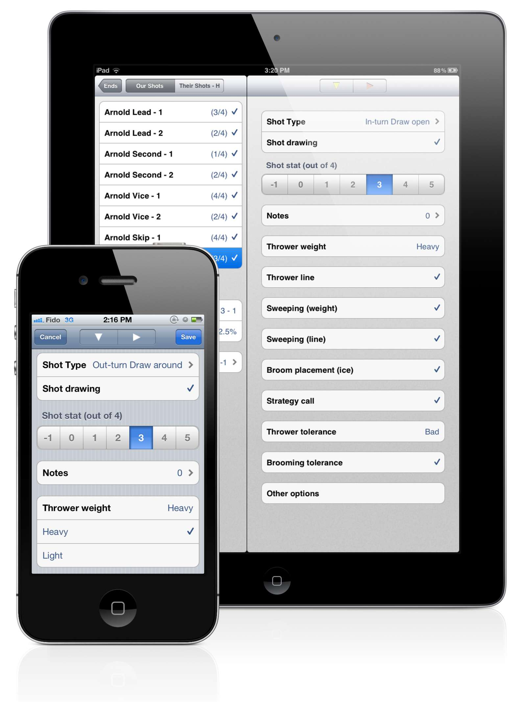

From its release in 2009 to its retirement in 2018 CurlBook was the premier curling coaching software for iOS, used around the world by national teams, including Curling Canada.

[Learn more about CurlBook at it's archived website](http://curlbook.andrewflemming.net)

